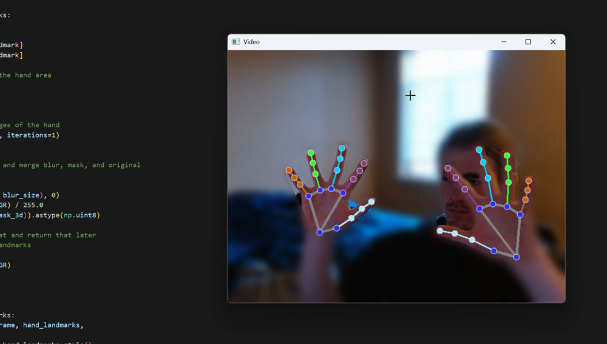

# Webcam Hand Tracking & Gesture Interaction

**Turn a webcam feed into an interactive hand-controlled obstacle game.**

This ECE 2390 team project uses a webcam to locate a player's hands and detect contact with moving on-screen obstacles. It connects hand tracking with collision feedback and scoring, using pretrained MediaPipe models rather than training a new classifier.

`Python` · `OpenCV` · `MediaPipe` · `NumPy` · `Jupyter Notebook`

## Team demo

[Watch or download the 25.5-second recording](hand-tracking-demo.mp4)

The preview shows two-hand landmark tracking and selective background blur in the team's application. It illustrates the vision features, not a collision-detection benchmark or my individual authorship of the full system.

**How to view:** click the preview or video link above. No installation or repository access is needed to view the public recording. If GitHub does not play the file in your browser, use its download button and open the MP4 locally. This is a recorded demonstration, not a hosted interactive application.

## My contributions

- **Testing and analysis:** ran application tests and analyzed the game's observed behavior.
- **Code changes:** adjusted timing-related code and hand–obstacle collision logic.

The system features below describe the team's implementation; my work focused on testing, analysis, and these targeted changes.

## What the project does

- **Tracks hands:** processes webcam frames with MediaPipe and overlays hand landmarks.
- **Builds a hand mask:** creates a convex hull around landmarks and expands the region with morphological dilation.
- **Adds interactive feedback:** tests overlap between the hand mask and obstacles, displays collision feedback, and maintains a score and high score.
- **Exposes processing controls:** lets the user toggle grayscale, CLAHE contrast enhancement, background blur, landmark overlays, and mask visualization.

## Engineering approach

1. Capture a webcam frame using OpenCV.
2. Optionally apply grayscale conversion and CLAHE contrast enhancement.
3. Convert the frame for MediaPipe hand-landmark detection.
4. Build and dilate a convex-hull hand mask.
5. Check mask overlap with obstacle regions.
6. Render landmarks, obstacles, score, and collision feedback.

The hand mask connects vision to game logic: its overlap with an obstacle triggers collision feedback. Background blur is applied after landmark detection and changes the displayed image, not the detector's input.

## Implementation evidence

| Artifact | What it demonstrates |
| --- | --- |
| `main.ipynb` | Webcam pipeline, hand-mask construction, moving rectangular obstacles, collision checks, score and high-score logic |
| `sjx_demo.ipynb` | An additional game variant with rectangular, circular, and vertically moving obstacles and elapsed-time scoring |
| `examples/main.py` | MediaPipe's pretrained gesture recognizer and hand-landmark visualization |
| `process.ipynb` | Separate Canny/GrabCut/morphology experiments; not the same as the live game's processing pipeline |

These artifacts document the implementation. End-to-end latency and accuracy have not been established by a reproducible benchmark, so no quantified improvement is claimed here.

## Testing considerations & next steps

- **Collision boundaries:** the convex hull and dilation approximate the hand's area, trading boundary coverage for a larger hitbox.
- **Edge cases:** test partial off-screen obstacles and clip collision regions to image bounds.
- **Timing:** evaluate frame-rate-dependent behavior and document how timing changes affect the game.
- **Separation of concerns:** decouple collision checks from the landmark-display toggle in the main notebook.

These are follow-up validation opportunities, not claims that the corresponding tests or fixes have already been completed.

## Running the original application

The original implementation requires a local webcam, Python, OpenCV, MediaPipe, NumPy, and Jupyter. The source notebooks are in the private course repository, not this public showcase. Access requires the repository owner's authorization; a reproducible installation guide and dependency versions are not yet published here.

## Project context

Team: Haozhe Yang, Nick Dematteis, Jingxiao Sun, and Nick Corey.

The original course repository remains private. This case study includes a team demonstration recording; the full implementation is not redistributed. The recording also shows part of the development workspace.

[Back to my profile](https://github.com/Haozhe-peter)
